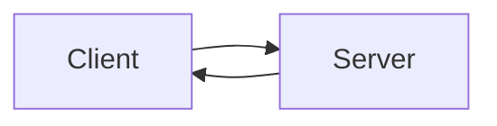
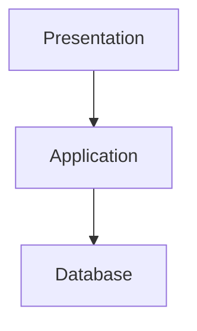

# Book-Management-System

# Phases for Book Management System (BMS)

## 1. Requirements
- It should be able to add books.
- BMS should store Title, Author, ISBN, Publication Date, and Genre.
- The system should provide a user-friendly interface.

## 2. Design
- Frontend: HTML form for entering book details.
- Backend: Can be added later using JavaScript or a server-side language.

## 3. Implementation
- Create the HTML page.
- Add the fields for book details.

## 4. Testing
- Check that all form fields accept input correctly.
- Verify that the form works without errors.

## 5. Deployment
- Making the project in the GitHub repository.

## 6. Maintenance
- Fix bugs and errors.
- Add new features such as search, edit, and delete books.

# Client-Server Model

# 3-Tier Architecture

